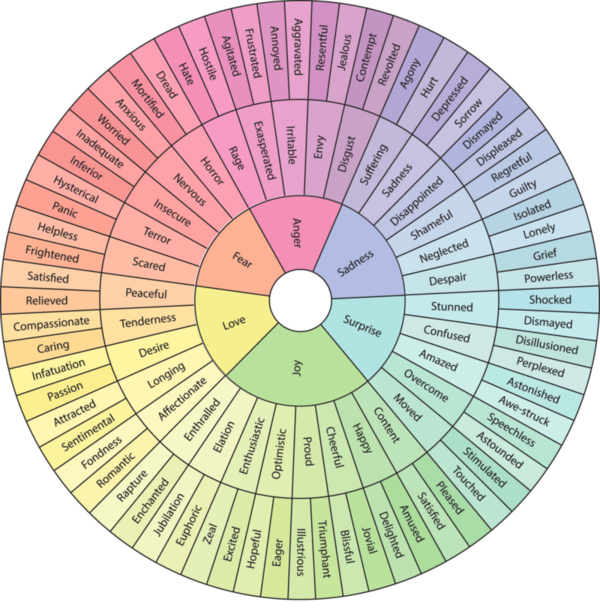

# pyemotionwheel



`pyemotionwheel` is a Python library that provides a programmatic interface to an emotion wheel, a simple psychological tool for identifying and articulating emotions.

The library models an emotion wheel as a hierarchical tree structure, with primary emotions at its core and more nuanced secondary and tertiary emotions branching out.

This tool can be especially beneficial in therapeutic settings, educational environments, and personal development for enhancing emotional intelligence.

## Why does pyemotionwheel exist?

In the realm of psychology, identifying and articulating emotions is an essential step towards understanding and managing them effectively.

**My bond with the emotion wheel is also _deeply personal._**

Surviving a near-fatal car accident at 13 years old, combined with growing up in a broken home, led to my emotions shutting down to cope with the trauma and ensuing family turmoil.

Two decades later, I began to unlock those surpressed emotions.

**The emotion wheel, a seemingly simple tool, proved crucial for me to identify and express my feelings, enhancing my emotional literacy.**

As a developer, I felt called to create an open source implementaiton of the emotion wheel that myself and other programmers can utilize in their own projects.

## Installation

You can install `pyemotionwheel` and its dependencies using `pip`:

```shell
$ pip install pyemotionwheel anytree
```

The only dependency is [anytree](https://anytree.readthedocs.io/en/latest/), a simple, lightweight implementation of a [Tree](https://en.wikipedia.org/wiki/Tree_(data_structure)) data structure. Since an emotion wheel is effectively just a hierarchical representation of emotions, a Tree data structure can naturally be used.

## Usage

Here's how to utilize each of the public methods in the `EmotionWheel` class, along with a few common use patterns.

### Instantiate the emotion wheel

Instantiate an instance of the emotion wheel, then show the tree structure:

```python
>> > from pyemotionwheel import BasicEmotionWheel
>> > wheel = BasicEmotionWheel()
>> > print(wheel)
root
├── Anger
│   ├── Rage
│   │   ├── Hate
│   │   └── Hostile
│   ├── Exasperated
│   │   ├── Agitated
│   │   └── Frustrated
│   ├── Irritable
│   │   ├── Annoyed
│   │   └── Aggravated
│   ├── Envy
│   │   ├── Resentful
│   │   └── Jealous
│   └── Disgust
│       ├── Contempt
│       └── Revolted
├── Sadness
│   ├── Suffering
│   │   ├── Agony
│   │   └── Hurt
│   ├── Despondent
│   │   ├── Depression
│   │   └── Sorrow
│   ├── Disappointed
│   │   ├── Dismayed
│   │   └── Displeased
│   ├── Shameful
│   │   ├── Regretful
│   │   └── Guilty
│   ├── Neglected
│   │   ├── Isolated
│   │   └── Lonely
│   └── Despair
│       ├── Grief
│       └── Powerless
├── Surprise
│   ├── Stunned
│   │   ├── Shocked
│   │   └── Dismayed
│   ├── Confused
│   │   ├── Disillusioned
│   │   └── Perplexed
│   ├── Amazed
│   │   ├── Astonished
│   │   └── Awe - struck
│   ├── Overcome
│   │   ├── Speechless
│   │   └── Astounded
│   └── Moved
│       ├── Stimulated
│       └── Touched
├── Joy
│   ├── Content
│   │   ├── Pleased
│   │   └── Satisfied
│   ├── Happy
│   │   ├── Amused
│   │   └── Delighted
│   ├── Cheerful
│   │   ├── Jovial
│   │   └── Blissful
│   ├── Proud
│   │   ├── Triumphant
│   │   └── Illustrious
│   ├── Optimistic
│   │   ├── Eager
│   │   └── Hopeful
│   ├── Enthusiastic
│   │   ├── Excited
│   │   └── Zeal
│   ├── Elation
│   │   ├── Euphoric
│   │   └── Jubilation
│   └── Enthralled
│       ├── Enchanted
│       └── Rapture
├── Love
│   ├── Affectionate
│   │   ├── Fondness
│   │   └── Romantic
│   ├── Longing
│   │   ├── Sentimental
│   │   └── Attracted
│   ├── Desire
│   │   ├── Passion
│   │   └── Infatuation
│   ├── Tenderness
│   │   ├── Caring
│   │   └── Compassionate
│   └── Peaceful
│       ├── Relieved
│       └── Satisfied
└── Fear
├── Sacred
│   ├── Frightened
│   └── Helpless
├── Terror
│   ├── Panic
│   └── Hysterical
├── Insecure
│   ├── Inferior
│   └── Inadequate
├── Nervous
│   ├── Worried
│   └── Anxious
└── Horror
├── Mortified
└── Dread
```

### All emotions

To get _all_ emotions present in the tree, ignoring any hierachical structure:

```python
>>> wheel.all_emotions()
(EmotionNode(name='Anger'),
 EmotionNode(name='Rage'),
 EmotionNode(name='Hate'),
 EmotionNode(name='Hostile'),
 EmotionNode(name='Exasperated'),
 EmotionNode(name='Agitated'),
 EmotionNode(name='Frustrated'),
 EmotionNode(name='Irritable'),
 EmotionNode(name='Annoyed'),
...
```

### Primary emotions

Retrieve all primary emotions (i.e., first level of the wheel):

```python
>>> wheel.primary_emotions()
(EmotionNode(name='Anger'),
 EmotionNode(name='Sadness'),
 EmotionNode(name='Surprise'),
 EmotionNode(name='Joy'),
 EmotionNode(name='Love'),
 EmotionNode(name='Fear'))
```

### Secondary emotions

Retrieve all secondary eotions (i.e., second level of the wheel):

```python
>>> wheel.secondary_emotions()
(EmotionNode(name='Rage'),
 EmotionNode(name='Exasperated'),
 EmotionNode(name='Irritable'),
 EmotionNode(name='Envy'),
 EmotionNode(name='Disgust'),
 EmotionNode(name='Suffering'),
...
```

### Tertiary emotions

Retrieve all tertiery emotions (i.e., third and final level of the wheel):

```python
>>> wheel.tertiary_emotions()
(EmotionNode(name='Hate'),
 EmotionNode(name='Hostile'),
 EmotionNode(name='Agitated'),
 EmotionNode(name='Frustrated'),
 EmotionNode(name='Annoyed'),
...
```

### Find a specific emotion

You can lookup a specific emotion in the wheel by supplying the `name` of the emotion:

```python
>>> wheel.find_emotion("excited")
EmotionNode(name='Excited')
```

### Get the path of an EmotionNode back to the root

We can better understand the composition of an emotion by tracing it back to its root:

```python
>>> compassionate = wheel.find_emotion("Compassionate")
>>> compassionate.path[::-1]
(EmotionNode(name='Compassionate'),
 EmotionNode(name='Tenderness'),
 EmotionNode(name='Love'),
 EmotionNode(name='root'))
```

The tertiary emotion, _"Compassionate"_, consists of _"Tenderness"_ as the secondary emotion, and finally _"Love"_ as the primary emotion.

### Get all children of an EmotionNode

To understand how a parent emotion can be decomposed into its potential child emotions, we can inspect the `children` of a given `EmotionNode`:

```python
>>> nervous = wheel.find_emotion("Nervous")
>>> nervous.children
(EmotionNode(name='Worried'), EmotionNode(name='Anxious'))
```

The _"Nervous"_ secondary emotion has two associated tertiary emotions: _"Worried"_ and _"Anxious"_.

## Creating a simple AI therapist

As a practical use case of the `pyemotionwheel` package, let's discover how to build a simple AI-assisted therapist who specializes in emotional intelligence.

Our AI therapist will accept an input journal entry, analyze the emotions, and then provide us with practical tools to deepen and move through our feelings.

**[👉 You can find a working example of our AI therapist here](https://github.com/jrosebr1/pyemotionwheel/blob/main/examples/ai_emotional_intelligence.ipynb).**

The rest of this section provides an overview of the code.

### Configuring OpenAI

We'll be using OpenAI for this example, so let's be sure to import the required packages (you may also need to install [openai](https://github.com/openai/openai-python) if it's not already on your system):

```
from pyemotionwheel import BasicEmotionWheel
import openai
import json

openai.api_key = "..."
```

### Using AI to recognize emotions in a journal entry

First, let's create an instance of our `BasicEmotionWheel`:

```
wheel = BasicEmotionWheel()
```

Now let's create a prompt to recognize emotions in a journal entry:

```
identify_emotions_prompt_template = """
Act as an expert psychologist who specializes in emotional intelligence.

Your job is to analyze my << JOURNAL ENTRY >> and identify which << EMOTIONS >> are present. These emotions come from my emotion wheel. Any emotions you identify MUST come the << EMOTIONS >> list. If you identify an emotion that is NOT present in the emotion list, use the most similar emotion from the list.

Omit any pre and post-text in your response. Format your response as a JSON list using the << JSON TEMPLATE >>.

<< JOURNAL ENTRY >>
{journal_entry}

<< EMOTIONS >>
{emotion_list}

<< JSON TEMPLATE >>
{
	"emotions": []
}
"""
```

We then have our `journal_entry` string:

```
journal_entry = """
Tuesday, November 6th

It's like the whole world just flipped into grayscale. She broke up with me. Right there in the cafeteria, with the buzz of a hundred conversations around us. It felt like someone sucked all the air out of the room. I could barely hear her over the noise in my head, the kind of noise that doesn't have a sound but still screams at you.

I don't get it. Yesterday, we were talking about the band's new song, and she was looking at me with those eyes that made me feel like I was actually somebody. Today, she's handing me back my hoodie like it's some kind of contaminated evidence.

I went through the rest of the day like a ghost. I couldn't focus on the teachers, the lessons, or the homework. It was all just a blur. I kept replaying that moment over and over, looking for some sign, something I missed. Did I say something? Did I not say something? It's like trying to find a piece in a puzzle that just doesn't fit anywhere.

The worst part? The pity looks. Everyone knows. They whisper and steal glances like I'm on display in some twisted museum of heartbreak. I wanted to scream, to tell them all to just shut up, but what's the point? They wouldn't get it. They don't know what it's like to feel everything so deeply that it's like drowning, but instead of fighting for air, you just want to sink.

I can't even escape into music tonight. Every lyric seems like it's mocking me, every chord is a reminder of her. I tried writing something, anything. All that came out were scribbles and scratched-out lines that looked more like the ravings of a madman than any kind of poetry or song.

Mom knocked on my door earlier, asked if I'm okay. I told her I'm fine, just tired. I'm not fine. I'm so far from fine it's like I'm on a different planet. And I'm tired, but not the kind of tired sleep can fix. I'm tired in my bones, in my soul.

I don't know what to do with all this... this rage, this sadness, this... emptiness. She was a part of my day, every day, and now there's just this hole where she used to be. It's like someone carved out a piece of me, and I'm just supposed to go on like everything's normal.

But it's not. Nothing's normal. And the worst part is, tomorrow, I have to get up and do it all over again. Walk the same halls, see the same faces, and pretend like I didn't just get ripped in half.

For now, I'll just sit here in the dark, with my guitar lying next to me, unplayed. Maybe sleep will come, maybe it won't. Maybe I'll wake up and this will all just be some bad dream.

But who am I kidding? This is real, and it's not going anywhere. And neither am I.
"""
```

Note that the above journal entry was generated by ChatGPT using the following prompt:

> _"Act as an angsty emo teenager who's girlfriend just broke up with him at lunch. Write his journal entry that evening."_

Not that ever happened to me or anything...

The final step before submitting the prompt to OpenAI is to fill in the `{journal_entry}` and `{emotion_list}` variables:

```
emotions_list = [str(e) for e in wheel.all_emotions()]
prompt = identify_emotions_prompt_template.replace(
    "{journal_entry}", journal_entry)
prompt = prompt.replace("{emotion_list}", ",".join(emotions_list))
print(prompt)
```

Note how the `{emotion_list}` is a call to `wheel.all_emotions()`, which returns _all_ emotions from the emotion wheel.

Here is the resulting prompt:

```
Act as an expert psychologist who specializes in emotional intelligence.

Your job is to analyze my << JOURNAL ENTRY >> and identify which << EMOTIONS >> are present. These emotions come from my emotion wheel. Any emotions you identify MUST come the << EMOTIONS >> list. If you identify an emotion that is NOT present in the emotion list, use the most similar emotion from the list.

Omit any pre and post-text in your response. Format your response as a JSON list using the << JSON TEMPLATE >>.

<< JOURNAL ENTRY >>

Tuesday, November 6th

It's like the whole world just flipped into grayscale. She broke up with me. Right there in the cafeteria, with the buzz of a hundred conversations around us. It felt like someone sucked all the air out of the room. I could barely hear her over the noise in my head, the kind of noise that doesn't have a sound but still screams at you.

I don't get it. Yesterday, we were talking about the band's new song, and she was looking at me with those eyes that made me feel like I was actually somebody. Today, she's handing me back my hoodie like it's some kind of contaminated evidence.

I went through the rest of the day like a ghost. I couldn't focus on the teachers, the lessons, or the homework. It was all just a blur. I kept replaying that moment over and over, looking for some sign, something I missed. Did I say something? Did I not say something? It's like trying to find a piece in a puzzle that just doesn't fit anywhere.

The worst part? The pity looks. Everyone knows. They whisper and steal glances like I'm on display in some twisted museum of heartbreak. I wanted to scream, to tell them all to just shut up, but what's the point? They wouldn't get it. They don't know what it's like to feel everything so deeply that it's like drowning, but instead of fighting for air, you just want to sink.

I can't even escape into music tonight. Every lyric seems like it's mocking me, every chord is a reminder of her. I tried writing something, anything. All that came out were scribbles and scratched-out lines that looked more like the ravings of a madman than any kind of poetry or song.

Mom knocked on my door earlier, asked if I'm okay. I told her I'm fine, just tired. I'm not fine. I'm so far from fine it's like I'm on a different planet. And I'm tired, but not the kind of tired sleep can fix. I'm tired in my bones, in my soul.

I don't know what to do with all this... this rage, this sadness, this... emptiness. She was a part of my day, every day, and now there's just this hole where she used to be. It's like someone carved out a piece of me, and I'm just supposed to go on like everything's normal.

But it's not. Nothing's normal. And the worst part is, tomorrow, I have to get up and do it all over again. Walk the same halls, see the same faces, and pretend like I didn't just get ripped in half.

For now, I'll just sit here in the dark, with my guitar lying next to me, unplayed. Maybe sleep will come, maybe it won't. Maybe I'll wake up and this will all just be some bad dream.

But who am I kidding? This is real, and it's not going anywhere. And neither am I.


<< EMOTIONS >>
Anger,Rage,Hate,Hostile,Exasperated,Agitated,Frustrated,Irritable,Annoyed,Aggravated,Envy,Resentful,Jealous,Disgust,Contempt,Revolted,Sadness,Suffering,Agony,Hurt,Despondent,Depression,Sorrow,Disappointed,Dismayed,Displeased,Shameful,Regretful,Guilty,Neglected,Isolated,Lonely,Despair,Grief,Powerless,Surprise,Stunned,Shocked,Dismayed,Confused,Disillusioned,Perplexed,Amazed,Astonished,Awe-struck,Overcome,Speechless,Astounded,Moved,Stimulated,Touched,Joy,Content,Pleased,Satisfied,Happy,Amused,Delighted,Cheerful,Jovial,Blissful,Proud,Triumphant,Illustrious,Optimistic,Eager,Hopeful,Enthusiastic,Excited,Zeal,Elation,Euphoric,Jubilation,Enthralled,Enchanted,Rapture,Love,Affectionate,Fondness,Romantic,Longing,Sentimental,Attracted,Desire,Passion,Infatuation,Tenderness,Caring,Compassionate,Peaceful,Relieved,Satisfied,Fear,Scared,Frightened,Helpless,Terror,Panic,Hysterical,Insecure,Inferior,Inadequate,Nervous,Worried,Anxious,Horror,Mortified,Dread

<< JSON TEMPLATE >>
{
	"emotions": []
}
```

this we submit the prompt to OpenAI to recognize emotions in the journal entry:

We can now submit the prompt to OpenAI to identify emotions in the journal entry:

```
completion = openai.chat.completions.create(
    model="gpt-4",
    temperature=0.7,
    messages=[{
        "role": "user",
        "content": prompt
    }]
)
blob = json.loads(completion.choices[0].message.content)
identified_emotions = blob["emotions"]
identified_emotions
```

The `identified_emotions` now includes:

```
['Sadness',
 'Depression',
 'Despair',
 'Rage',
 'Frustrated',
 'Disappointed',
 'Isolated',
 'Lonely',
 'Neglected',
 'Powerless',
 'Suffering',
 'Agony',
 'Hurt',
 'Confused',
 'Disillusioned']
```

We now have a list of all emotions identified from the journal entry.

### Using pyemotionwheel to provide context to our AI therapist

At this point, we have a list of emotions identified in the journal.

The next step is to augment these emotions with both:

1. The path from the emotion back to the root
2. The children nodes of the emotion

Once we have this information we can construct a prompt that asks our AI therapist to help us work through our emotions.

Let's get started by extracting the emotion path and children nodes, and inserting them into a dictionary:

```
emotion_hierarchies = {}

for emotion_name in identified_emotions:
    emotion = wheel.find_emotion(emotion_name)
    emotion_hierarchies[emotion_name] = {
        "path": [str(e) for e in emotion.path[::-1]],
        "children": [str(e) for e in emotion.children],
    }
```

If we inspect the `emotion_hierarchies` dictionary, it will look like:

```
{'Sadness': {'path': ['Sadness', 'root'],
  'children': ['Suffering',
   'Despondent',
   'Disappointed',
   'Shameful',
   'Neglected',
   'Despair']},
 'Depression': {'path': ['Depression', 'Despondent', 'Sadness', 'root'],
  'children': []},
 'Despair': {'path': ['Despair', 'Sadness', 'root'],
  'children': ['Grief', 'Powerless']},
 'Rage': {'path': ['Rage', 'Anger', 'root'], 'children': ['Hate', 'Hostile']},
 'Frustrated': {'path': ['Frustrated', 'Exasperated', 'Anger', 'root'],
  'children': []},
 'Disappointed': {'path': ['Disappointed', 'Sadness', 'root'],
  'children': ['Dismayed', 'Displeased']},
 'Isolated': {'path': ['Isolated', 'Neglected', 'Sadness', 'root'],
  'children': []},
 'Lonely': {'path': ['Lonely', 'Neglected', 'Sadness', 'root'],
  'children': []},
 'Neglected': {'path': ['Neglected', 'Sadness', 'root'],
  'children': ['Isolated', 'Lonely']},
 'Powerless': {'path': ['Powerless', 'Despair', 'Sadness', 'root'],
  'children': []},
 'Suffering': {'path': ['Suffering', 'Sadness', 'root'],
  'children': ['Agony', 'Hurt']},
 'Agony': {'path': ['Agony', 'Suffering', 'Sadness', 'root'], 'children': []},
 'Hurt': {'path': ['Hurt', 'Suffering', 'Sadness', 'root'], 'children': []},
 'Confused': {'path': ['Confused', 'Surprise', 'root'],
  'children': ['Disillusioned', 'Perplexed']},
 'Disillusioned': {'path': ['Disillusioned', 'Confused', 'Surprise', 'root'],
  'children': []}}
```
  
### Prompting our AI therapist to help us work through our emotions

Given our `emotion_hierarchies`, let's see how oru AI therapist can help us deepen our emotional intelligence.

To start, let's create an emotional intelligence prompt:

```
eq_prompt_template = """
Below I have included the emotion wheel hierarchy for each of the << IDENTIFIED EMOTIONS >> in my << JOURNAL ENTRY >>.

Using your expert knowledge as a psychologist and therapist to help me:

1. Use emotional intelligence to trace my emotions back to the root
2. Deepen my emotions and move through the children nodes, ideally finding release in the depening

Be specific in your advice, and show your thinking step-by-step. Use the tone and style of an empathetic, caring therapist.

Format your response as Markdown, omitting any pre or post text.

<< JOURNAL ENTRY >>
{journal_entry}

<< IDENTIFIED EMOTIONS >>
{identified_emotions}
"""
```

We'll then fill in the prompt:

```
prompt = eq_prompt_template.replace("{journal_entry}", journal_entry)
prompt = prompt.replace("{identified_emotions}",
                        json.dumps(emotion_hierarchies))
```

The resulting `prompt` now looks like:

```
Below I have included the emotion wheel hierarchy for each of the << IDENTIFIED EMOTIONS >> in my << JOURNAL ENTRY >>.

Using your expert knowledge as a psychologist and therapist to help me:

1. Use emotional intelligence to trace my emotions back to the root
2. Deepen my emotions and move through the children nodes, ideally finding release in the depening

Be specific in your advice, and show your thinking step-by-step. Use the tone and style of an empathetic, caring therapist.

Format your response as Markdown, omitting any pre or post text.

<< JOURNAL ENTRY >>

Tuesday, November 6th

It's like the whole world just flipped into grayscale. She broke up with me. Right there in the cafeteria, with the buzz of a hundred conversations around us. It felt like someone sucked all the air out of the room. I could barely hear her over the noise in my head, the kind of noise that doesn't have a sound but still screams at you.

I don't get it. Yesterday, we were talking about the band's new song, and she was looking at me with those eyes that made me feel like I was actually somebody. Today, she's handing me back my hoodie like it's some kind of contaminated evidence.

I went through the rest of the day like a ghost. I couldn't focus on the teachers, the lessons, or the homework. It was all just a blur. I kept replaying that moment over and over, looking for some sign, something I missed. Did I say something? Did I not say something? It's like trying to find a piece in a puzzle that just doesn't fit anywhere.

The worst part? The pity looks. Everyone knows. They whisper and steal glances like I'm on display in some twisted museum of heartbreak. I wanted to scream, to tell them all to just shut up, but what's the point? They wouldn't get it. They don't know what it's like to feel everything so deeply that it's like drowning, but instead of fighting for air, you just want to sink.

I can't even escape into music tonight. Every lyric seems like it's mocking me, every chord is a reminder of her. I tried writing something, anything. All that came out were scribbles and scratched-out lines that looked more like the ravings of a madman than any kind of poetry or song.

Mom knocked on my door earlier, asked if I'm okay. I told her I'm fine, just tired. I'm not fine. I'm so far from fine it's like I'm on a different planet. And I'm tired, but not the kind of tired sleep can fix. I'm tired in my bones, in my soul.

I don't know what to do with all this... this rage, this sadness, this... emptiness. She was a part of my day, every day, and now there's just this hole where she used to be. It's like someone carved out a piece of me, and I'm just supposed to go on like everything's normal.

But it's not. Nothing's normal. And the worst part is, tomorrow, I have to get up and do it all over again. Walk the same halls, see the same faces, and pretend like I didn't just get ripped in half.

For now, I'll just sit here in the dark, with my guitar lying next to me, unplayed. Maybe sleep will come, maybe it won't. Maybe I'll wake up and this will all just be some bad dream.

But who am I kidding? This is real, and it's not going anywhere. And neither am I.


<< IDENTIFIED EMOTIONS >>
{"Sadness": {"path": ["Sadness", "root"], "children": ["Suffering", "Despondent", "Disappointed", "Shameful", "Neglected", "Despair"]}, "Depression": {"path": ["Depression", "Despondent", "Sadness", "root"], "children": []}, "Despair": {"path": ["Despair", "Sadness", "root"], "children": ["Grief", "Powerless"]}, "Rage": {"path": ["Rage", "Anger", "root"], "children": ["Hate", "Hostile"]}, "Frustrated": {"path": ["Frustrated", "Exasperated", "Anger", "root"], "children": []}, "Disappointed": {"path": ["Disappointed", "Sadness", "root"], "children": ["Dismayed", "Displeased"]}, "Isolated": {"path": ["Isolated", "Neglected", "Sadness", "root"], "children": []}, "Lonely": {"path": ["Lonely", "Neglected", "Sadness", "root"], "children": []}, "Neglected": {"path": ["Neglected", "Sadness", "root"], "children": ["Isolated", "Lonely"]}, "Powerless": {"path": ["Powerless", "Despair", "Sadness", "root"], "children": []}, "Suffering": {"path": ["Suffering", "Sadness", "root"], "children": ["Agony", "Hurt"]}, "Agony": {"path": ["Agony", "Suffering", "Sadness", "root"], "children": []}, "Hurt": {"path": ["Hurt", "Suffering", "Sadness", "root"], "children": []}, "Confused": {"path": ["Confused", "Surprise", "root"], "children": ["Disillusioned", "Perplexed"]}, "Disillusioned": {"path": ["Disillusioned", "Confused", "Surprise", "root"], "children": []}}
```

The emotional intelligence prompt can now be submitted to OpenAI:

```
completion = openai.chat.completions.create(
    model="gpt-4",
    temperature=0.7,
    messages=[{
        "role": "user",
        "content": prompt
    }]
)
response = completion.choices[0].message.content
```

Let's see what our AI therapist has to say:

```
# Unpacking Emotions

This is clearly a hard time for you, and I want to commend you for sharing your feelings and experiences. By identifying your emotions, you've already taken a significant step towards understanding your emotional response to this situation.

## Tracing Back to Root Emotions

Starting with **sadness**, it seems to be a primary emotion here. The breakup has left you feeling sad and downcast. This is not surprising, as you've lost something significant in your life. Sadness is a natural response to loss. The fact that you're also experiencing **depression** and **despair** tells me that this sadness is deep and pervasive. You're feeling the weight of the loss, and it's impacting your daily life.

Moving on to **anger**, this emotion is often a response to feeling wronged or slighted. You mention feeling **rage** and **frustration**, which could be directed towards the situation, your ex-partner, or even yourself. It's important to remember that anger, while uncomfortable, is a natural response to hurt and loss. It's a way of protecting ourselves from the pain.

Lastly, you mentioned feeling **confused**. This is likely stemming from the surprise or shock of the breakup. You are searching for reasons, trying to make sense of what happened. This is a normal part of processing a sudden change or loss.

## Deepening Understanding of Emotions

Let's now move deeper into these emotions, exploring the children nodes to better understand what you're feeling.

Starting with **sadness**, you've identified feelings of **suffering**, **despondent**, **disappointed**, **shameful**, **neglected**, and **despair**. These emotions suggest a profound sense of loss and a struggle with self-worth. You may feel like you've lost a part of yourself, and you're grappling with feelings of rejection.

Under **anger**, you've identified **rage** and **frustration**. These intense feelings may be a response to a perceived unfairness or a violation of your expectations. You may feel betrayed, which could be fueling your anger.

Under **confusion**, there is **disillusionment**. This emotion speaks to a loss of innocence or a shattering of your expectations. This can be a difficult emotion to navigate as it often comes with a sense of disappointment and a loss of trust.

## Advice Moving Forward

Remember, it's okay to feel these intense emotions. They are a normal part of the grieving process after a significant loss. Acknowledge your feelings without judgment. Allow yourself to feel them fully, but try not to get swept away by them.

When you feel ready, consider expressing your feelings through a creative outlet. You mentioned your guitar and writing. Use these as tools to channel your emotions and to heal.

Remember, it's okay to seek support. Reach out to friends and family, or consider speaking to a mental health professional. They can provide you with strategies to manage your emotions and navigate this difficult time.

Take care of your physical health. Exercise, eat well, and try to get adequate sleep. These things can significantly impact your emotional well-being.

Lastly, be patient with yourself. Healing takes time. Allow yourself to move through this at your own pace. There's no right or wrong way to grieve.

Remember, you're not alone. It's okay to ask for help. You're going through a tough time, but with support, resilience, and self-care, you will get through this.
```

## Future work

- Create a sunburst-like visualization for the `BasicEmotionWheel` class. Something similar to [plotly's implementation](https://plotly.com/python/sunburst-charts/) would be great, but maybe use matplotlib instead?
- Implement a `PlutchikEmotionWheel` class, based on the work of [Robert Plutchik](https://en.wikipedia.org/wiki/Robert_Plutchik). [@alfonsosemeraro](https://github.com/alfonsosemeraro) has a [fantastic implementation](https://github.com/alfonsosemeraro/pyplutchik) that can likely be extended for my particular uses.

## License

`pyemotionwheel` is released under the MIT License. This means it is free to use, modify, and distribute, including for commercial use, provided the license and copyright notice are preserved.
